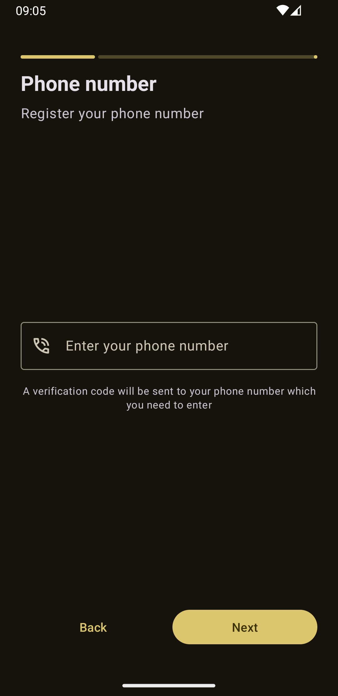
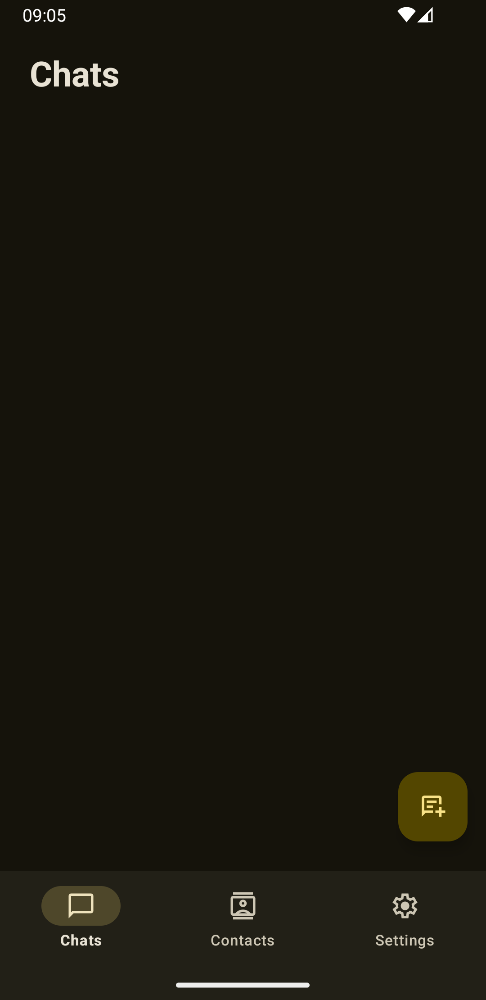

# Teenvana

> [!IMPORTANT]
> This application is currently in the active development process. We value your ideas! Please contribute by opening **Issues** or submitting **Pull Requests**. For our future plans, check out our [roadmap](ROADMAP.md).

Teenvana is a  messenger application tailored for teens and young adults, focusing on speed, simplicity.

## ✨ Features

* 💬 **Real-Time Messaging** — Fast and reliable delivery of messages with status indicators (sent/delivered/read).
* 👥 **Group Chats** — Create vibrant communities and stay connected with your friends in large groups.
* 📂 **Rich Media Sharing** — Seamlessly send photos, videos, and documents without heavy compression.
* 🌓 **Dynamic Themes** — Fully customizable UI with seamless switching between Light and Dark modes.
* 🔒 **Privacy First** — Secure communication with a focus on data protection and user privacy.
* 🚀 **Instant Previews** — Real-time content visualization for links and media files.
* 📱 **Adaptive Layout** — Optimized for a consistent experience across all Android screen sizes.

## 🛠 Tech Stack

* **Language:** Java 
* **UI Framework:** XML / View System 
* **Minimum SDK:** Android 12 (API 31) 
* **Build System:** Groovy DSL 

## 🚀 Getting Started

1.  **Fork the repository:**
2.  **Clone it**
```git clone https://github.com/yourusername/teenvana.git```
3.  **Open in Android Studio:** It is recommended to use the latest version (Ladybug or newer).
4.  **Build & Run:** Ensure you have an emulator or device running **Android 12 (API 31) or newer**.

## 📸 Screenshots
<p align="center">
  
  
  
</p>